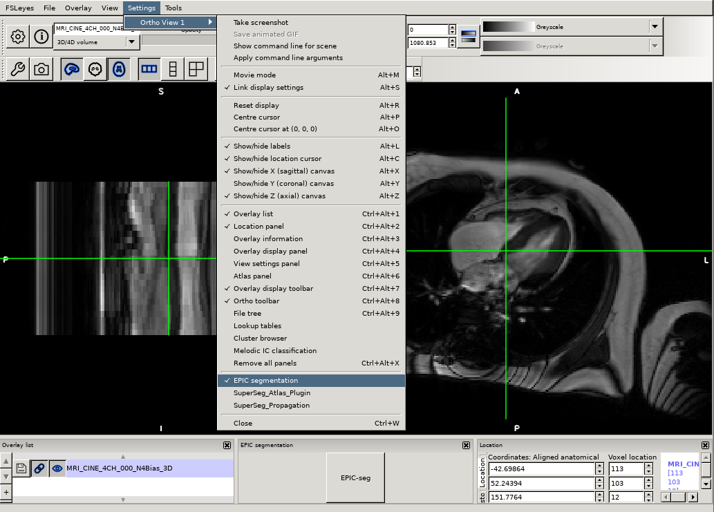
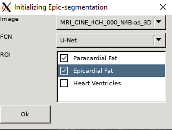
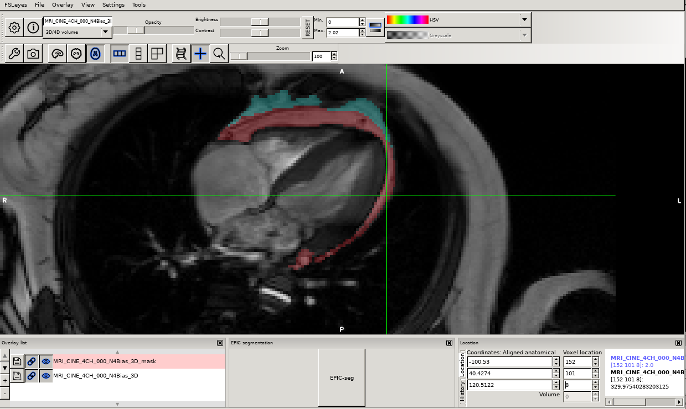

.. |right_arrow| unicode:: U+21D2

.. _overview:

=========================================
Epicardial & Paracardial fat segmentation
=========================================

How to use the EpicSeg plugin
-----------------------------

If you have not yet install the plugin please follow the instruction given in this section :ref:`install_plugin`.

In order to load the plugin on the current View, go to **File**  --> **Ortho View 1** --> **Epic segmentation**

The EpicSeg plugin will appears at the bottom center of your FSLeyes software as shown below:

After clicking on the *EPIC-seg* button, a dialog box will open where you have to choose differents parameters :

- **Image** : A cine four-chamber MRI in the list of loaded images in FSLeyes
- **FCN** :  A fully convolutional network (UNet) 
- **ROI** : Regions of interests to segment. It could be epicardial, paracardial fat or/and heart ventricles

After clicking on **Ok**, The selected **FCN**, optimised U-Net, segment the selected **Image** and generate a mask comprising of selected **ROI**.

